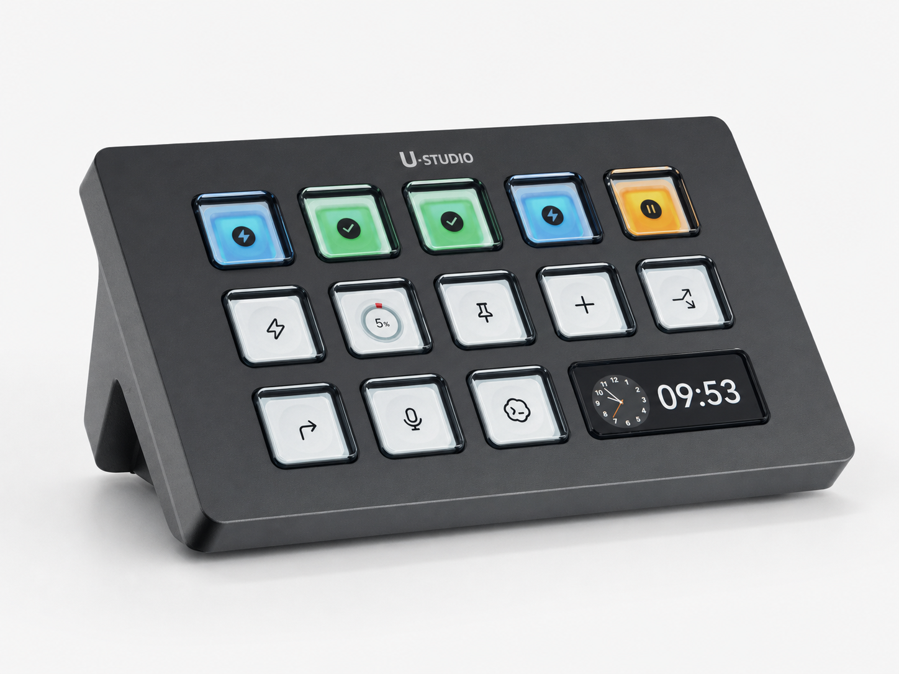
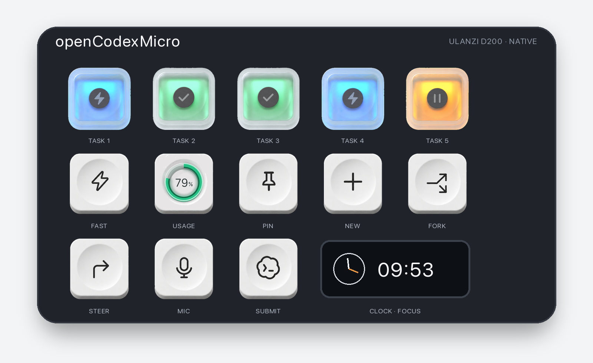
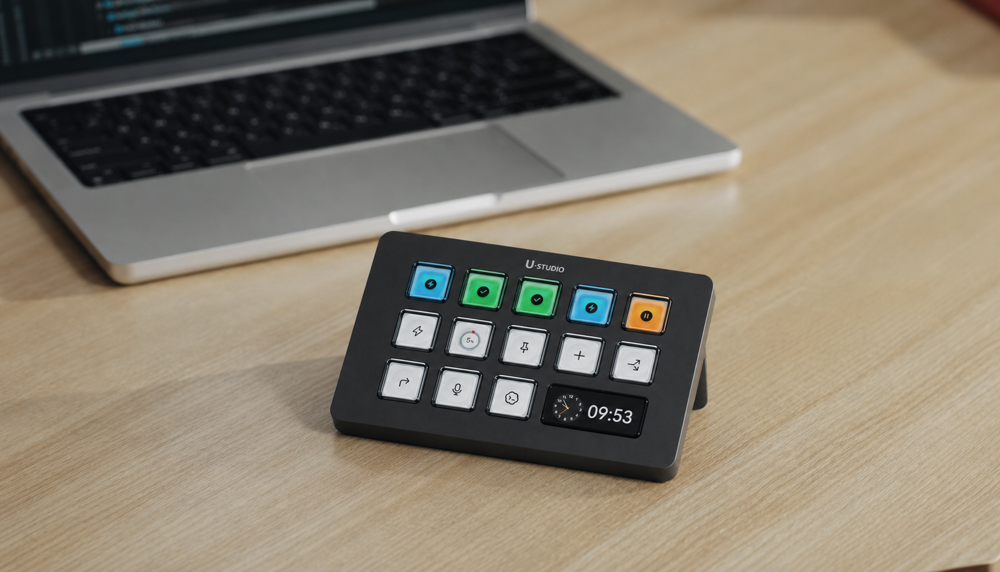

# openCodexMicro

**Turn your Ulanzi D200 into Codex Micro — plus the controls that make it a
complete Codex Desktop companion.**

[中文说明](README_zh.md)



openCodexMicro gives Codex Desktop a dedicated hardware surface. See what your
latest tasks are doing, jump between them with one press, and keep the actions
you use most under your fingertips.

## What it does

| Feature | Behavior |
| --- | --- |
| Five live task keys | Follow Codex's Most Recent order and show idle, thinking, complete, input/approval, or error |
| Instant task switching | Opens the exact task shown on the physical key |
| Codex controls | Fast, Pin, New, Fork, Steer, Mic, and Submit |
| Usage at a glance | Shows the remaining weekly allowance and refreshes it automatically |
| Clock and Focus | Keeps the D200 firmware clock and uses it as a Codex focus key |
| Native integration | Uses Codex app-server, rollout events, and `codex://` deep links—no browser debugging port |
| Responsive display | Sends only changed keys and keeps input ahead of display transfers |
| Hot-plug recovery | Reconnects to the D200 and restores its last known display |





This is an unofficial project for **macOS, Codex Desktop, and Ulanzi D200**.
The entire project was vibe-coded with Codex.

## Install

Requirements:

- macOS with Codex Desktop installed
- Ulanzi D200 connected over USB
- Node.js 20+
- Python 3.11+ with `venv`

Clone the repository, then run:

```bash
npm run setup
```

The installer creates an isolated Python environment, installs `hidapi` and
Pillow, registers a user LaunchAgent, and starts openCodexMicro. Existing
CodexKeyboard installations are migrated automatically; a legacy custom theme
is copied before the old runtime is removed.

The first simulated shortcut may trigger a macOS Accessibility permission
prompt. Allow the installed Python process to control `System Events`.

See [Setup and operations](docs/setup-and-operations.md) for permissions,
logs, diagnostics, updates, migration, and uninstall instructions.

## Configure

openCodexMicro follows Codex Desktop's own shortcuts instead of maintaining a
second shortcut system.

Shortcut overrides:

```text
~/.codex/keybindings.json
```

Submit and Steer behavior:

```text
~/.codex/config.toml
```

Theme overrides:

```text
~/Library/Application Support/openCodexMicro/icon-theme.json
```

Shortcut and Desktop settings are read when a key is pressed, so they normally
do not require a driver restart. Theme changes require a display refresh.

See [Configuration](docs/configuration.md) for supported commands, shortcut
syntax, Submit/Steer behavior, physical key remapping, and theme options.

The repository also includes reusable Codex skills:

| Skill | Purpose |
| --- | --- |
| [`install-open-codex-micro`](skills/install-open-codex-micro/SKILL.md) | Install or update, confirm shortcut changes, review permissions, and choose whether to start the daemon |
| [`customize-open-codex-micro-icons`](skills/customize-open-codex-micro-icons/SKILL.md) | Replace or generate task and action icons |
| [`remap-open-codex-micro-keys`](skills/remap-open-codex-micro-keys/SKILL.md) | Move existing controls or implement a new key action |

## Documentation

- [Configuration](docs/configuration.md)
- [Setup and operations](docs/setup-and-operations.md)
- [Architecture](docs/architecture.md)
- [D200 protocol notes](docs/d200-standalone.md)
- [Engineering constraints](docs/errors.md)

## License

Released under the [MIT License](LICENSE). See
[THIRD_PARTY_NOTICES.md](THIRD_PARTY_NOTICES.md) for third-party attributions.
